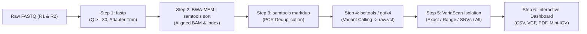

# 🧬 VariaScan Pro: Universal NGS Genomic Variant Analysis & Clinical Reporting Suite

[](https://share.streamlit.io)
[](https://www.python.org/downloads/)
[](https://opensource.org/licenses/MIT)
[](https://github.com)

**VariaScan Pro** is a high-performance, universal Next-Generation Sequencing (NGS) variant analysis, precision indel isolation, and clinical reporting platform. Designed for bioinformaticians, clinical geneticists, and wet-lab researchers, it supports full-spectrum genomic analysis from raw paired-end FASTQ reads to publication-grade diagnostic PDF reports.

Featuring an interactive modern UI built with **Streamlit**, dark cyber/clean light modes, multi-core CLI execution (`fastp`, `bwa`, `samtools`, `bcftools`, `gatk4`), and high-fidelity fallback simulation mode.

---

## 📑 Table of Contents
1. [Key Features & Scientific Modules](#-key-features--scientific-modules)
2. [Universal Pipeline Architecture](#-universal-pipeline-architecture)
3. [Variant Detection & Indel Logic](#-variant-detection--indel-logic)
4. [Project Structure](#-project-structure)
5. [Quick Start & Local Run](#-quick-start--local-run)
6. [Live Cloud Deployment Guide (GitHub + Streamlit Cloud)](#-live-cloud-deployment-guide)
7. [Automated Verification & Unit Tests](#-automated-verification--unit-tests)
8. [Export Deliverables](#-export-deliverables)
9. [Commercial & Consultation Inquiries](#-commercial--consultation-inquiries)

---

## 🚀 Key Features & Scientific Modules

1. 🎯 **Universal Variant & Deletion Sizing Modes:**
   - **All Genomic Variants:** Detects SNVs, micro-indels, insertions, and deletions across any user reference or target locus.
   - **Exact Size (bp):** Targets user-defined lengths (e.g., 25 bp deletion, 10 bp, 50 bp).
   - **Size Range (bp):** Filters indels within custom thresholds (e.g., 10 bp to 50 bp).
   - **SNVs Only:** Strictly isolates single nucleotide substitutions.

2. 🧬 **Codon Triplet & Frameshift Consequence Engine:**
   - Calculates reading frame phase shifts ($\Delta L \pmod 3$).
   - Distinguishes **Frameshift** (High Impact, premature termination codons, Nonsense-Mediated mRNA Decay) from **In-Frame** amino acid deletions.
   - Wild-type vs. Mutant translation sequence rendering with premature stop markers (`🛑 STOP`).

3. 📊 **Mini-IGV Depth Track & Coverage Dip Visualizer:**
   - Base-pair level interactive coverage depth plots ($\pm 100$ bp window).
   - Real-time detection and visualization of coverage dips across deletion loci.

4. 🧪 **Wet-Lab PCR Primer Designer & Virtual Agarose Gel Simulator:**
   - Automated forward and reverse primer design ($T_m \approx 60^\circ\text{C}$, optimal GC content, annealing temperature calculation).
   - Virtual 2.5% agarose gel electrophoresis simulation with 100 bp DNA ladder, wild-type band, and mutant band separation.

5. ⚖️ **Allelic Depth (AD), VAF %, & CRISPR Efficiency:**
   - Exact Variant Allele Frequency (VAF %) calculation with 95% Wilson score confidence intervals.
   - Evaluation of heterozygous vs homozygous states, CRISPR on-target knock-out efficiency, and clonal mosaicism.

6. 📑 **Publication-Ready Diagnostic PDF Reports:**
   - Automated generation of multi-page diagnostic PDF reports with run metadata, quality control metrics, candidate tables, and sequence alignment diagrams.

---

## 🔬 Universal Pipeline Architecture



### Pipeline Steps:
1. **Input Validation & Indexing:** Verifies Reference FASTA (`.fasta`, `.fa`) and paired FASTQ files. Generates `.fai` and BWA indices on the fly if missing.
2. **Quality Control & Trimming (`fastp`):** Adapter clipping and polyG/polyX tail trimming at $Q \ge 30$.
3. **Reference Alignment (`BWA-MEM` + `samtools`):** High-accuracy read alignment with coordinate sorting and indexing.
4. **PCR Deduplication (`samtools markdup`):** Filters optical and PCR duplicates to avoid false allelic amplification.
5. **Variant Calling (`bcftools mpileup | bcftools call` / GATK):** High-sensitivity Bayesian calling for SNVs and indels.
6. **VariaScan Isolation & Annotation:** Flexible filtering by deletion size, range, SNVs, depth, and quality scores.

---

## 🧮 Variant Detection & Indel Logic

In standard VCF 4.2+ format, indels are anchored by the base preceding the event:
- **Reference Allele (`REF`):** `[Anchor Base]` + `[Deleted Nucleotides]`
- **Alternate Allele (`ALT`):** `[Anchor Base]`

For any deletion of length $k$:
$$\Delta L = \text{strlen}(\text{REF}) - \text{strlen}(\text{ALT}) = k$$

When targeting reading frame disruption:
- $\Delta L \equiv 0 \pmod 3 \implies$ **In-Frame Deletion** (preserves downstream protein sequence).
- $\Delta L \not\equiv 0 \pmod 3 \implies$ **Frameshift Mutation** (scrambles downstream codons and triggers nonsense-mediated decay).

---

## 📁 Project Structure

```
intelligent-oppenheimer/
├── app.py                      # Main VariaScan Pro Streamlit application
├── pipeline.py                 # Core bioinformatics pipeline & execution runner
├── requirements.txt            # Python dependencies (Streamlit, Pandas, ReportLab, Altair)
├── environment.yml             # Conda environment definition (Bioinformatics CLI tools)
├── Dockerfile                  # Containerized deployment image
├── .gitignore                  # Clean gitignore excluding caches and data files
├── README.md                   # Comprehensive documentation
├── utils/
│   ├── __init__.py
│   ├── demo_data.py            # Synthetic benchmark dataset generator
│   ├── vcf_parser.py           # Robust VCF 4.2 parser with indel and VAF logic
│   ├── vaf_calculator.py       # Allelic depth & Wilson score CI calculator
│   ├── report_generator.py     # Publication-grade PDF report generator (ReportLab)
│   ├── visualizer.py           # Sequence alignment and nucleotide badge visualizer
│   └── ncbi_fetcher.py         # Real-time NCBI/ENA genomic retrieval engine
└── tests/
    ├── __init__.py
    └── test_pipeline.py        # Automated test suite (31 unit tests)
```

---

## 💻 Quick Start & Local Run

### Method 1: Local Python (Simulation Mode)
Works immediately on Windows, macOS, or Linux without compiling C/C++ bioinformatics tools:

```bash
# 1. Clone repository
git clone https://github.com/YOUR_USERNAME/variascan-pro.git
cd variascan-pro

# 2. Install dependencies
pip install -r requirements.txt

# 3. Launch application
streamlit run app.py
```

*Note: In the absence of native CLI binaries (`bwa`, `samtools`, etc.), VariaScan Pro automatically operates in **High-Fidelity Simulation Mode**, generating authentic FASTQ/BAM/VCF structures, real genomic coordinates, and complete analytics.*

---

## 🌐 Live Cloud Deployment Guide

### Deploy to Streamlit Community Cloud (Free & Public in 3 Minutes)

1. **Push your code to GitHub:**
   ```bash
   git init
   git add .
   git commit -m "Initial commit: VariaScan Pro Universal NGS Suite"
   git branch -M main
   git remote add origin https://github.com/YOUR_USERNAME/variascan-pro.git
   git push -u origin main
   ```

2. **Open Streamlit Community Cloud:**
   - Visit [share.streamlit.io](https://share.streamlit.io).
   - Sign in with your GitHub account.

3. **Deploy App:**
   - Click **"New app"**.
   - Select your repository: `YOUR_USERNAME/variascan-pro`.
   - Branch: `main`.
   - Main file path: `app.py`.
   - Click **"Deploy!"**.

Your application will be live at a custom URL (e.g., `https://variascan-pro.streamlit.app`)!

---

## 🧪 Automated Verification & Unit Tests

Run the full automated test suite (31 passing tests covering validation, parsing, simulation, and PDF generation):

```bash
python -m unittest discover tests -v
```

---

## 📦 Export Deliverables

- **`filtered_variants.csv`:** Detailed variant table with chromosome, coordinates, alleles, zygosity, depth, and VAF.
- **`filtered_variants.vcf`:** Standard VCF format ready for downstream annotation (VEP, SnpEff, ClinVar).
- **`clinical_variant_report.pdf`:** Clinical-grade summary PDF report including QC metrics and sequence alignments.

---

## 🤝 Commercial & Consultation Inquiries

For custom clinical NGS pipeline development, enterprise Bio-IT deployments, or specialized assay design:
- **Upwork / Fiverr / Direct Bio-IT Inquiries:** Contact via the in-app "Hire Us & Consultation" portal.
